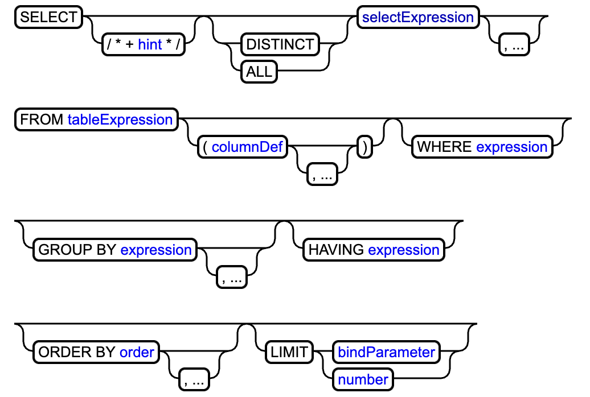

# Understanding a SQL parser
The SQL parser aims serves one purpose. To take in a tokenized sql query and output a Relational Algebra (RA) AST that can be traversed top down to apply storage operations. The SQL Parser can be split into 2 main steps: building the SQL AST & converting to RA AST. Since SQL has no direct mapping to storage operations, we need to output a RA AST as the SQL optimizer takes in RA AST and chooses the best storage operations to execute an RA operation. 

## SQL Grammar
Before building the AST, it is necessary to understand SQL grammar as the Parser uses these grammar rules to build up the SQL AST. SQL grammar defines the syntax of a SQL query. 

### SELECT statements

This image shows the general grammar of a select statements. It is characterized by a main timeline with mandatory components like SELECT clause, select expression, FROM clause, and a semicolon to end the statement. Everything branch from the main timeline is an optional query. For example, not all SELECT statements will have WHERE or GROUP BY clause. With this overarching grammar set in place, each 

## Building AST
### Building Tree
Before building up the actual AST, we need to specify what properties the tree should have. 

First, it is important to note that a SQL AST is NOT a binary search tree. Suppose the parser is given the query 

**SELECT c1, c2, c3 FROM table1, table2 WHERE c1.id <> c2.id;** 

From the grammar rules stated above, the root should be a SELECT statement, and the statement can be dissected into 3 distinct sections: Select, From, and Where. These ought to represent the next hierarchial layer of the tree. Since there can be more than 2, then there is no way a binary search tree could accurately represent a SQL statement.

Second, the 

## SQL to RA
Relational Algebra has base and extended operators. Base operators can be combined together to create the extended operators, but it isn't necesary to do so
To map SQL to RA there are some direct mappings:
- SELECT = projection $\pi$
- FROM = relation that needs to be 

## Sources
SQL Grammar: https://forcedotcom.github.io/phoenix/index.html#select_expression 
SQL to RA: https://cs.ulb.ac.be/public/_media/teaching/infoh417/sql2alg_eng.pdf